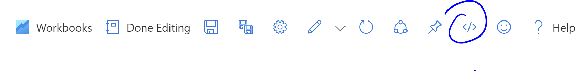
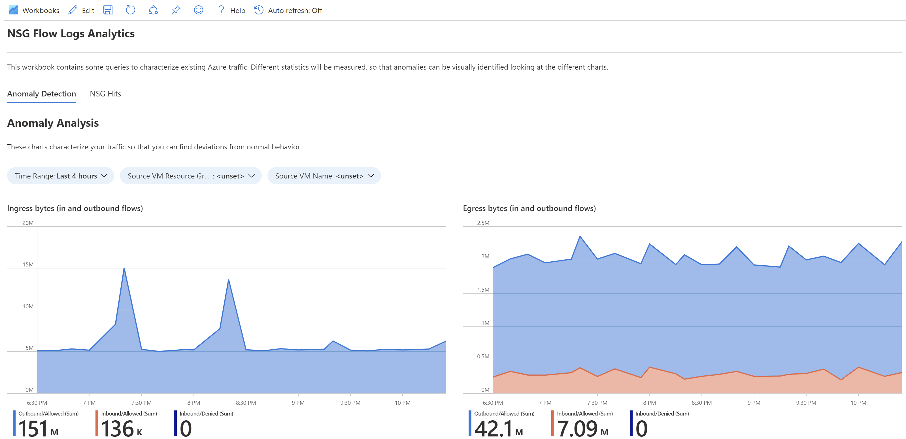
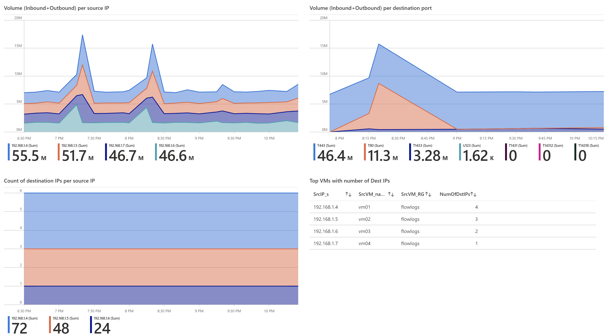
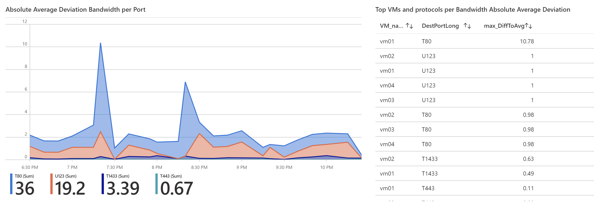
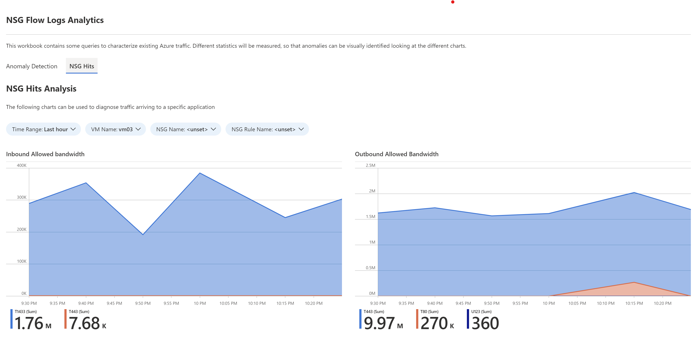
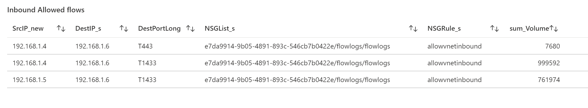
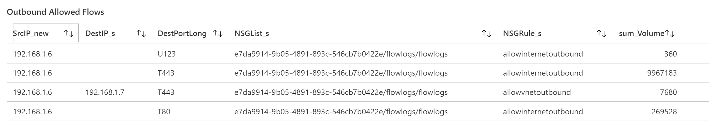

# Flow Log Analytics Workbook

The workbook in this repository contains some sample queries to extract information out of Azure Flow Logs exported to an Azure Log Analytics Workspace.

## Installation

You just need to create an empty workbook, hit the Edit button, and then go to the code view:

Your can now paste the code of the file in this repo ([workbook.json](./workbook.json)), and you are done.

## Screenshots

Following some screenshots of the workbook:

### Anomaly detection

The first step is looking at the overall bandwidth.

After that, you can have a look at bandwidth per VM and per protocol. The amount of destination IP that each VM talks to might be of interest too, since it could be used to detect network exploration activity.

And lastly, sudden bandwidth increments might indicate some data exfiltration. Normalizing average deviations allows to detect bandwidth increases in protocols that otherwise consume less bandwidth, such as DNS.

### NSG Hits

The second use case of this workbook is analyzing the matches for the NSG applied to a certain VM. Here again, the first step is an overview:

You can analyze the actual IP addresses that are matched. Using the rule name filter you can get the IP addresses hit by each rule.

